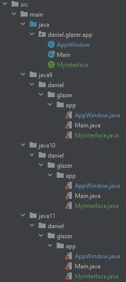

# Daniel Glazer

## Laboratoria Deployment

### Wielowydaniowy JAR

#### Utworzenie projektu

Pierwszym krokiem było utworzenie projektu mavenowego dla Javy 11.

#### Utworzenie katalogów dla różnych wersji Javy

Aby móc stworzyć wielowydaniowego jara należało utworzyć katalogi w podany poniżej sposób. Ważne było to, by utworzyć
takie same pakiety dla poszczególnych klas.



#### Skonfigurowanie pom'a

Aby maven przy budowaniu tworzył automatycznie wielowydaniowego jara, należało zaimplementować plugin do pom'a oraz
skonfigurować wersję Javy dla głównego katalogu.

```xml

<groupId>org.apache.maven.plugins</groupId>
<artifactId>maven-compiler-plugin</artifactId>
<version>3.8.1</version>
<executions>
<execution>
    <id>compile-java-1.8</id>
    <goals>
        <goal>compile</goal>
    </goals>
    <configuration>
        <source>1.8</source>
        <target>1.8</target>
    </configuration>
</execution>
...
<executions>
```

W kolejnym kroku należało zdefiniować ścieżki do pozostałych wersji Javy.
Poniżej przykład dla Javy 9:

```xml
<execution>
    <id>compile-java-9</id>
    <phase>compile</phase>
    <goals>
        <goal>compile</goal>
    </goals>
    <configuration>
        <release>9</release>
        <compileSourceRoots>
            <compileSourceRoot>${project.basedir}/src/main/java9</compileSourceRoot>
        </compileSourceRoots>
        <multiReleaseOutput>true</multiReleaseOutput>
    </configuration>
</execution>
```

Na sam koniec należało dodać plugin odpowiadający za ustawianie manifestów dla wielowydaniowego jara.

```xml
<plugin>
    <groupId>org.apache.maven.plugins</groupId>
    <artifactId>maven-jar-plugin</artifactId>
    <version>3.2.0</version>
    <configuration>
        <archive>
            <manifestEntries>
                <Multi-Release>true</Multi-Release>
            </manifestEntries>
            <manifest>
                <mainClass>daniel.glazer.app.Main</mainClass>
            </manifest>
        </archive>
    </configuration>
</plugin>
```

### Instalator

### Instalacja

W pierwszym kroku pobrano ze strony _launch4j-3.14_. Po zainstalowaniu i uruchomieniu programu pojawiło się okno:


### Konfiguracja

Aby poprawnie skonfigurować _launch4j_, należało w zakładce **JRE** uzupełnić minimalną i maksymalną wersję Javy.


W kolejnym kroku przełączono się na zakładkę **Basic**, gdzie w polu _Output file_ podano ścieżkę, do której ma 
zostać wygenerowany plik *.exe. Do pełnego funkcjonowania w polu _Jar_ podano ścieżkę do wielowydaniowego pliku .jar.


### Aplikacja 

Jeśli wszystko udało się wykonać poprawnie, to po naciśnięciu przycisku zębatki w wybranym katalogu powinien 
pojawić 
się plik *.exe o nazwie 
zdefiniowanej w polu _output file_.


