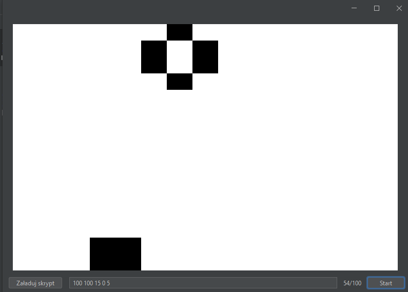
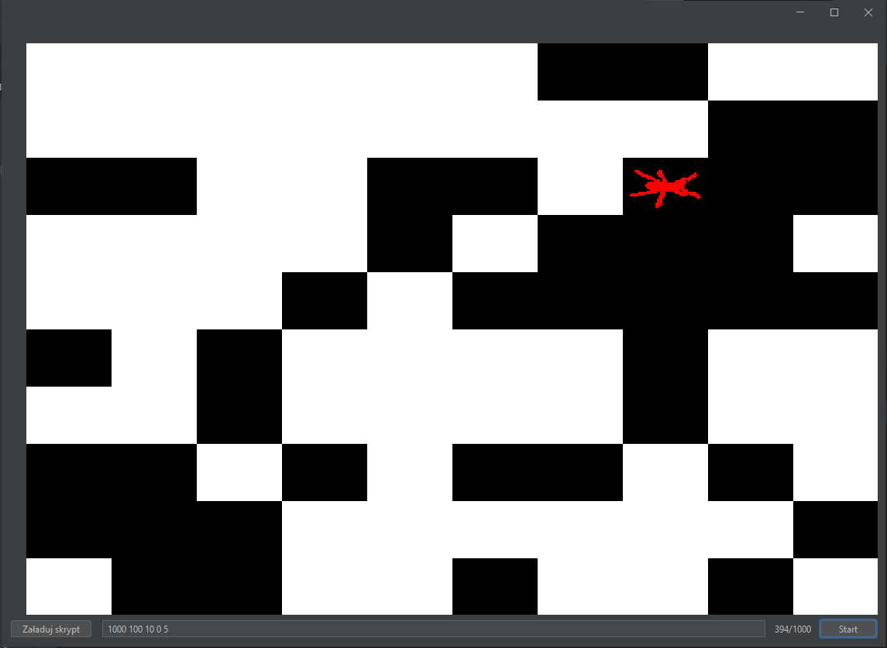

# Instrukcja użytkownika 
W celu uruchomienia skryptu automatu komórkowego należy:

1. Uruchomić aplikację
2. Nacisnąć przycisk - **Załaduj skrypt**
3. Wybrać interesujący nas skrypt JavaScript
4. Uzupełnić po spacji parametry startowe automatu, gdzie:
   * dla automatu gry w życie poszczególne parametry to: 
     * maksymalna liczba iteracji
     * czas pomiędzy iteracjami
     * rozmiar mapy
     * dolne ograniczenie losowania
     * górne ograniczenie losowania
   * dla automatu mrówki Langtona poszczególne parametry to:
       * maksymalna liczba iteracji
       * czas pomiędzy iteracjami
       * rozmiar mapy
       * współrzędna x mrówki 
       * współrzędna y mrówki
5. Następnie należy nacisnąć przycisk **Start** i automat zacznie funkcjonować

# Wyniki działania

## Przykładowy wynik działania dla gry w życie

## Przykładowy wynik działania dla mrówki Langtona

