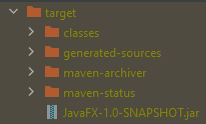
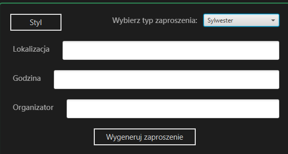

# Sprawozdanie

## Konfiguracja mavena

Aby wygenerować plik __*.jar__ należało dodać do pliku **pom.xml** odpowiednie zależności. Wewnątrz tagu _build_
należało dodać plugin **maven_shade_plugin**, w którym należało zdefiniować klasę główną:

````xml

<plugin>
    <artifactId>maven-shade-plugin</artifactId>
    <version>3.2.1</version>
    <executions>
        <execution>
            <phase>package</phase>
            <goals>
                <goal>shade</goal>
            </goals>
            <configuration>
                <transformers>
                    <transformer implementation="org.apache.maven.plugins.shade.resource.ManifestResourceTransformer">
                        <mainClass>glazer.daniel.app.javafx.Main</mainClass>
                    </transformer>
                </transformers>
            </configuration>
        </execution>
    </executions>
</plugin>
````

Podobnie sytuacja wyglądała w przypadku **javafx-maven-plugin**, dla którego też trzeba było zdefiniować klasę główną:

```xml
<plugin>
    <groupId>org.openjfx</groupId>
    <artifactId>javafx-maven-plugin</artifactId>
    <version>0.0.8</version>
    <executions>
        <execution>
            <id>default-cli</id>
            <configuration>
                <mainClass>glazer.daniel.app.javafx.Main</mainClass>
                <launcher>app</launcher>
                <jlinkZipName>app</jlinkZipName>
                <jlinkImageName>app</jlinkImageName>
                <noManPages>true</noManPages>
                <stripDebug>true</stripDebug>
                <noHeaderFiles>true</noHeaderFiles>
            </configuration>
        </execution>
    </executions>
</plugin>
```
Dodatkowo należało do zależności dodać **javafx-graphics**:

```xml
<dependency>
    <groupId>org.openjfx</groupId>
    <artifactId>javafx-graphics</artifactId>
    <version>11</version>
</dependency>
```

Po zbudowaniu poleceniem **mvn package** w folderze target pojawiał się _fat jar_


## Instrukcja użytkowania
W pierwszym kroku należy uruchomić aplikację, następnie można wybrać typ zaproszenia w prawym rogu. Istnieje kilka 
gotowych schematów, ale jest możliwość wczytania schematu z pliku. Plik musi zostać sformatowany w sposób następujący:
* w pierwszej linii znajduje się liczba pól do wpisania
* od drugiej linii do *n* liczby pól podawane są ich nazwy w kolejności występowania w schemacie
* w pozostałych liniach znajduje się schemat zaproszenia, gdzie 4 kropki (_...._) oznaczają miejsce do wpisania danych

Przykład pliku schematu:
```text
6
Organizatorzy
Rok rocznicy
Data
Godzina
Nazwa kościoła
Nazwa lokalu
....
Serdecznie zapraszają
Na mszę świętą z okazji .... rocznicy ślubu, która odbędzie się .... roku o godzinie ....
w kościele .....
Po mszy świętej serdecznie zapraszamy na przyjęcie na sali .....
```
Po wybraniu typu zaproszenia powinny pojawić się pola do uzupełnienia danymi:



Po uzupełnieniu pól danymi i naciśnięciu przycisku **Wygeneruj zaproszenie** w polu tekstowym pojawia się 
wygenerowane zaproszenie:


Dodatkową opcją jest zmiany stylu, po naciśnięciu przycisku można wybrać plik _*.css_, który załaduje inny 
styl aplikacji:


## Wyniki działania


